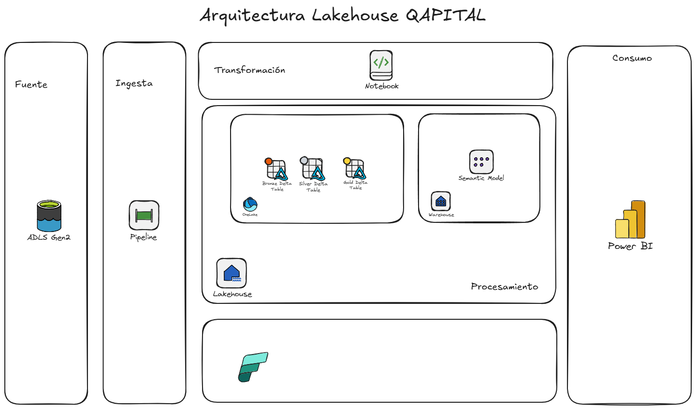
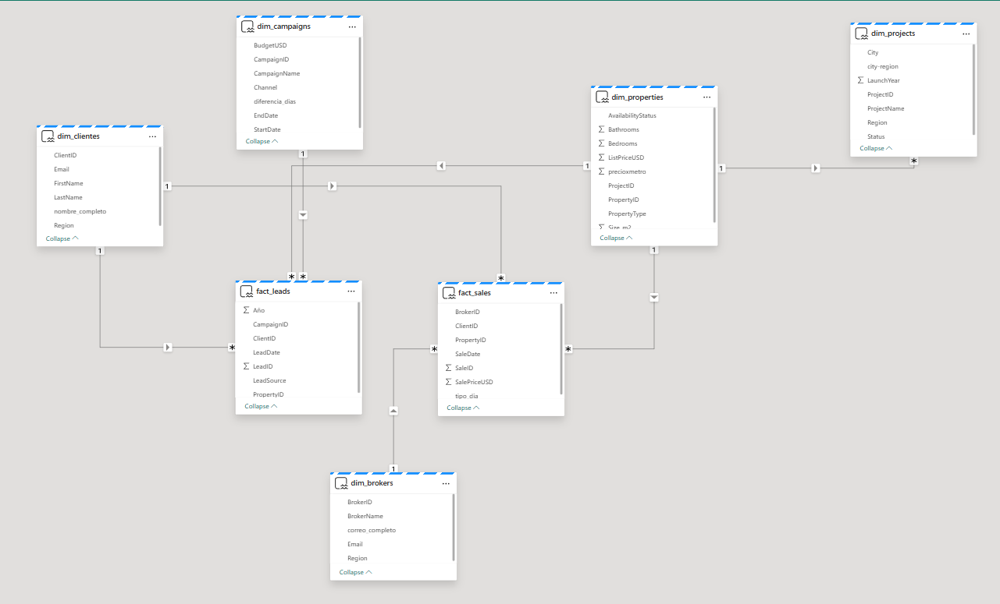
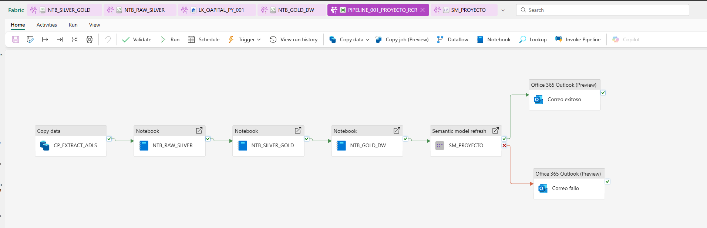

# Lakehouse QAPITAL

## 🎯 Descripción del proyecto

Este proyecto fue desarrollado como parte del programa **Microsoft Fabric Data Engineer** de **Datapath**, con el objetivo de construir una plataforma **data-driven** para la empresa **QAPITAL S.A.**, dedicada al desarrollo y comercialización de proyectos inmobiliarios en LATAM.

El caso de uso consistió en **integrar fuentes dispersas de información** (ventas, marketing, leads, brokers, propiedades y proyectos) dentro de una arquitectura **Lakehouse en Microsoft Fabric**, habilitando analítica descriptiva de desempeño comercial y marketing.

---

## ⚙️ Arquitectura general

La solución se diseñó bajo el enfoque **medallion (Bronze–Silver–Gold)** utilizando componentes nativos de **Microsoft Fabric**:

| Etapa | Descripción | Herramienta |
|-------|--------------|--------------|
| **Fuente** | Datos alojados en ADLS Gen2 | Azure Data Lake Storage |
| **Ingesta** | Pipelines para orquestar extracción y carga | Fabric Data Factory |
| **Transformación** | Limpieza, unión y modelado en Notebooks PySpark | Fabric Notebooks |
| **Procesamiento** | Lakehouse + OneLake con tablas Delta | OneLake |
| **Modelo semántico** | Warehouse + Semantic Model para consumo | Fabric Warehouse |
| **Consumo** | Dashboards interactivos para Pricing, Marketing ROI e Inventario | Power BI |

### 📊 Diagrama de arquitectura

---

## 🧩 Modelo de datos

El modelo final está compuesto por **hechos y dimensiones**, optimizado para analítica de performance comercial:

- **Hechos:** `fact_sales`, `fact_leads`  
- **Dimensiones:** `dim_clients`, `dim_brokers`, `dim_properties`, `dim_projects`, `dim_campaigns`

### 📘 Relaciones entre tablas

---

## 🔄 Pipeline de orquestación

El **pipeline principal** gestiona la ejecución automática del flujo completo:

1. Extracción desde ADLS Gen2  
2. Transformación en tres notebooks (Bronze → Silver → Gold)  
3. Actualización del modelo semántico  
4. Envío de alertas por correo si el proceso finaliza correctamente o con errores  

El archivo JSON del pipeline y los notebooks se encuentran en este repositorio para su revisión y reutilización.

---

## 🧰 Tecnologías utilizadas

- **Microsoft Fabric**
- **OneLake / Lakehouse**
- **Data Factory Pipelines**
- **PySpark (Notebooks)**
- **Power BI**
- **Delta Tables**
- **Azure Data Lake Gen2**

---

## 📈 Resultados esperados

- Reducción del *time-to-insight* de **48 h a 3 h**  
- Vista unificada del inventario inmobiliario y campañas  
- Capacidad de revisar los reportes de forma diaria  
- Gobernanza completa sobre datos personales y trazabilidad de procesos  

---
